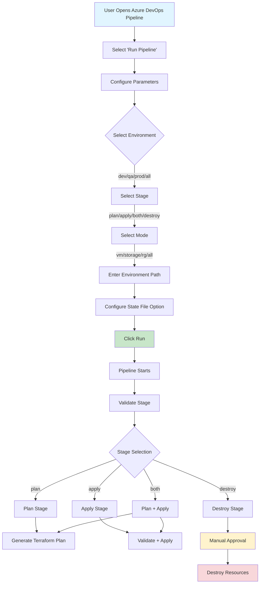

# Azure Terraform Pipeline - Workflow & Features

This document provides an overview of how users trigger the pipeline and lists all currently available features.

## Pipeline Trigger & Workflow

### Manual Trigger Process

The pipeline is **manually triggered only** (no automatic triggers on commits or PRs). Users must run the pipeline from Azure DevOps with the following parameters:



### Pipeline Parameters

| Parameter | Type | Default | Description | Options |
|-----------|------|---------|-------------|---------|
| **environment** | string | `dev` | Target environment | `dev`, `qa`, `prod`, `all` |
| **stage** | string | `plan` | Pipeline stage to execute | `plan`, `apply`, `both`, `destroy` |
| **mode** | string | `vm` | Resource type to deploy | `vm`, `storage`, `rg`, `all` |
| **env_folder_path** | string | `''` | Path to `meta.tfvars` in external repo | Example: `environments/dev/web-test` |
| **useResourceGroupStateFile** | boolean | `true` | State file path strategy | `true`: Use RG name, `false`: Use subscription 8 chars |

### Pipeline Stages

1. **Validate Stage** (Always runs first)
   - Validates pipeline parameters
   - Checks repository access

2. **Plan Stage** (Conditional)
   - Runs when `stage = plan` or `stage = both`
   - Generates Terraform execution plan
   - Shows what resources will be created/modified/destroyed
   - Does NOT make any changes

3. **Apply Stage** (Conditional)
   - Runs when `stage = apply` or `stage = both`
   - Validates Terraform configuration
   - Applies changes to create/modify resources
   - Auto-approval: `dev` = true, `qa/prod` = false (requires approval)

4. **Destroy Stage** (Conditional)
   - Runs when `stage = destroy`
   - Requires manual approval before execution
   - Destroys all resources in the target environment

## Current Features

### 🔐 Authentication & Security

- ✅ **Service Connection Authentication**
  - Uses Azure DevOps service connections (Service Principal)
  - No OIDC configuration required
  - Automatic credential management via `TerraformTaskV4@4`

- ✅ **Azure Key Vault Integration**
  - Retrieve VM credentials (username, password, SSH keys) from Key Vault
  - Fallback to direct values if Key Vault not configured
  - Supports RBAC and access policy authentication

### 📦 Resource Deployment Modes

#### 1. VM Mode (`mode = "vm"`)
Deploy virtual machines with comprehensive configuration options.

**Features:**
- ✅ **Single VM Deployment**
  - Custom VM names (e.g., `azuswebapp001`)
  - Auto-generated names using `name_prefix`
  
- ✅ **Multiple VM Deployment with Counter Pattern**
  - Deploy multiple VMs with sequential names (e.g., `webapp001`, `webapp002`, ..., `webapp010`)
  - Uses `name_base` and `count` parameters
  - All VMs share the same configuration (OS, size, image, etc.)
  
- ✅ **Mixed VM Deployments**
  - Combine multiple VM groups with different configurations
  - Add new VMs to existing state file without affecting existing resources
  - Support for different OS types (Linux/Windows) in the same deployment

- ✅ **Operating System Support**
  - Linux VMs (Ubuntu, RHEL, CentOS, etc.)
  - Windows VMs (Windows Server 2019, 2022, etc.)
  - Custom image selection (publisher, offer, SKU, version)

- ✅ **VM Configuration Options**
  - Custom VM sizes (Standard_DS2_v2, Standard_DS4_v2, etc.)
  - Multiple data disks with custom sizes and caching
  - Public IP address (optional)
  - Availability sets for high availability (auto-created for 2+ VMs)
  - Managed identities (system/user-assigned)

- ✅ **Credential Management**
  - Direct credentials in `meta.tfvars`
  - Key Vault secrets (username, password, SSH keys)
  - Auto-generated SSH key pairs
  - Auto-generated passwords for Windows VMs

#### 2. Storage Mode (`mode = "storage"`)
Deploy Azure Storage Accounts.

**Features:**
- ✅ Storage account creation with custom naming
- ✅ Storage account types (Standard, Premium)
- ✅ Performance tiers (Standard, Premium)
- ✅ Replication options (LRS, GRS, ZRS, etc.)
- ✅ Access tier configuration (Hot, Cool, Archive)
- ✅ Network access rules (public, private, VNet restrictions)
- ✅ Tags and metadata

#### 3. Resource Group Mode (`mode = "rg"`)
Create Azure Resource Groups.

**Features:**
- ✅ Resource group creation with custom names
- ✅ Location/region selection
- ✅ Create new or use existing resource groups
- ✅ Tags and metadata
- ✅ Automatic dependency management (RGs created before other resources)

#### 4. Combined Mode (`mode = "all"`)
Deploy multiple resource types in a single run.

**Features:**
- ✅ Deploy resource groups, VMs, and storage accounts together
- ✅ Automatic dependency resolution (series installation)
- ✅ Resource groups created first, then VMs/storage
- ✅ Shared resource group selection logic

### 🗂️ State File Management

- ✅ **Dynamic State File Paths**
  - Option 1: Resource Group-based paths
    - Format: `{rg-name}/terraform.tfstate`
    - Extracts RG name from `env_folder_path` (e.g., `environments/dev/web-test` → `web-test`)
  - Option 2: Subscription-based paths
    - Format: `{subscription-8-chars}/terraform.tfstate`
    - Uses last 8 characters of subscription ID

- ✅ **State Storage Configuration**
  - Container naming: `state-{env}` (e.g., `state-dev`, `state-qa`)
  - Storage account: `tfstate{subscription-last8}`
  - Automatic backend configuration via pipeline

- ✅ **State File Lifecycle**
  - Supports adding new resources to existing state files
  - Incremental updates (only new/modified resources are changed)
  - State file isolation per environment and resource group

### 🔄 Dependency Management

- ✅ **Series Installation (Automatic Ordering)**
  - Resource groups are created first
  - VMs and storage accounts are created after resource groups exist
  - Availability sets depend on resource groups
  - Uses Terraform `depends_on` for explicit dependencies

- ✅ **Cross-Resource Group Support**
  - VMs can reference subnets in different resource groups
  - VMs can reference subnets in different subscriptions
  - Full resource ID support for network resources

### 🌍 Multi-Environment Support

- ✅ **Environment Isolation**
  - Separate state files per environment (dev, qa, prod)
  - Environment-specific configurations via `meta.tfvars`
  - Environment-specific variable groups in Azure DevOps

- ✅ **Parallel Deployments**
  - Deploy to multiple environments simultaneously (`environment = "all"`)
  - Independent state files per environment
  - Environment-specific approval gates (QA/Prod require approval)

### 📋 External Configuration Repository

- ✅ **Environment Metadata Repository**
  - Separate repository for environment configurations (`meta.tfvars`)
  - Flexible folder structure (e.g., `environments/dev/web-test/`)
  - Configurable repository name and branch
  - Automatic checkout during pipeline execution

### 🛡️ Safety & Validation

- ✅ **Terraform Validation**
  - Syntax validation before plan/apply
  - Configuration validation
  - Variable validation

- ✅ **Plan Review**
  - Detailed plan output showing all changes
  - Plan artifacts published for review
  - No changes made during plan stage

- ✅ **Approval Gates**
  - Manual approval required for QA/Prod apply operations
  - Manual approval required for all destroy operations
  - Agentless approval jobs for destroy stage

- ✅ **Destroy Protection**
  - Separate destroy stage with manual confirmation
  - Destroy plan review before execution
  - Warning messages and confirmation prompts

### 🏷️ Tagging & Metadata

- ✅ **Automatic Tagging**
  - Mandatory tags: `env`, `owner`, `app`, `cost_center`, `lifecycle`
  - Additional custom tags per resource
  - Tag merging (custom tags + mandatory tags)

- ✅ **Resource Naming**
  - Custom naming conventions
  - Environment-aware naming
  - Prefix-based naming support

### 📊 Outputs & Monitoring

- ✅ **Terraform Outputs**
  - VM IDs, NIC IDs, IP addresses
  - Storage account names and endpoints
  - Resource group names
  - Auto-generated SSH private keys (sensitive)

- ✅ **Pipeline Artifacts**
  - Plan files published as artifacts
  - Logs and execution summaries
  - Error reporting and diagnostics

### 🔧 Advanced Features

- ✅ **Flexible Configuration**
  - Mode-based resource activation
  - Conditional resource creation
  - Optional parameters with defaults

- ✅ **Error Handling**
  - Early validation and error detection
  - Clear error messages
  - Rollback support via Terraform state

- ✅ **Local Testing Support**
  - Local backend configuration option
  - Local testing guide and examples
  - Development workflow support

## Feature Matrix

| Feature | VM Mode | Storage Mode | RG Mode | All Mode |
|---------|--------|--------------|--------|----------|
| Single Resource | ✅ | ✅ | ✅ | ✅ |
| Multiple Resources | ✅ | ✅ | ✅ | ✅ |
| Counter Pattern | ✅ | ❌ | ❌ | ✅ |
| Key Vault Integration | ✅ | ❌ | ❌ | ✅ |
| Availability Sets | ✅ | ❌ | ❌ | ✅ |
| Data Disks | ✅ | ❌ | ❌ | ✅ |
| Public IP | ✅ | ❌ | ❌ | ✅ |
| Managed Identity | ✅ | ❌ | ❌ | ✅ |
| Series Installation | ✅ | ✅ | ✅ | ✅ |
| State File Management | ✅ | ✅ | ✅ | ✅ |
| Multi-Environment | ✅ | ✅ | ✅ | ✅ |

## Usage Examples

### Example 1: Deploy Single VM
```
Parameters:
- environment: dev
- stage: both
- mode: vm
- env_folder_path: environments/dev/web-test
- useResourceGroupStateFile: true
```

### Example 2: Deploy 10 VMs with Counter Pattern
```
meta.tfvars:
vms = [{
  name_base = "webapp"
  count = 10
  os_type = "linux"
  ...
}]
```

### Example 3: Deploy All Resources (RG + VM + Storage)
```
Parameters:
- environment: dev
- stage: both
- mode: all
- env_folder_path: environments/dev/myapp-rg
```

### Example 4: Destroy All Resources
```
Parameters:
- environment: dev
- stage: destroy
- mode: all
- env_folder_path: environments/dev/web-test
```
(Requires manual approval)

## Next Steps

For detailed usage instructions, see:
- [Local Testing Guide](LOCAL_TESTING_GUIDE.md) - Test configurations locally
- [Quick Start Guide](QUICK_START_LOCAL_TEST.md) - Quick setup instructions
- [Backend State Verification](BACKEND_STATE_VERIFICATION.md) - State file management

